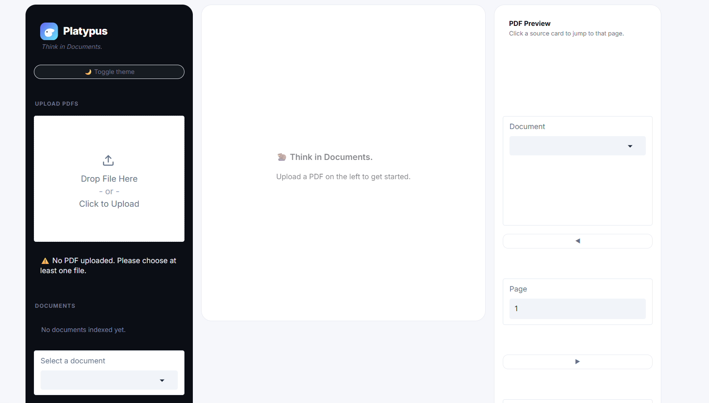
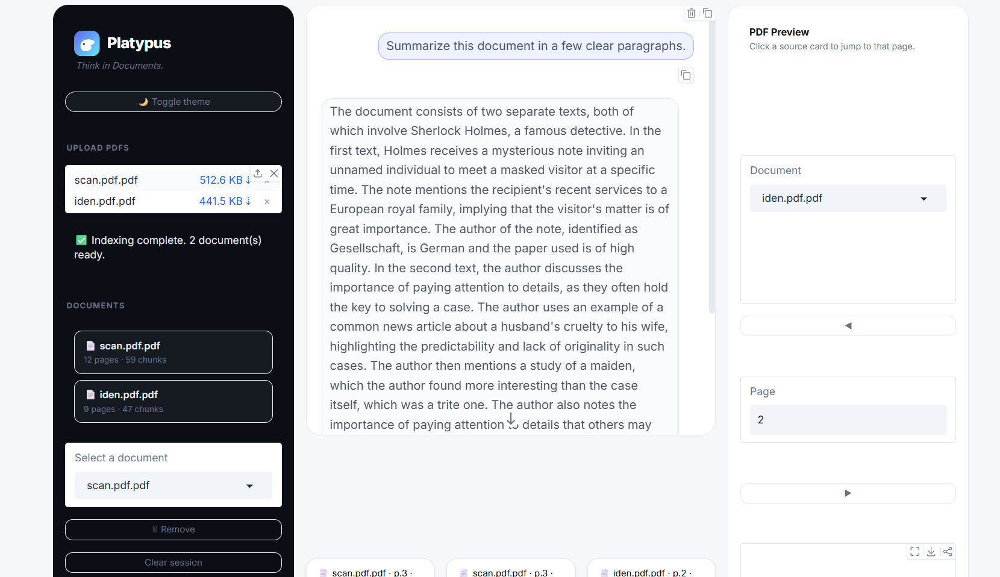
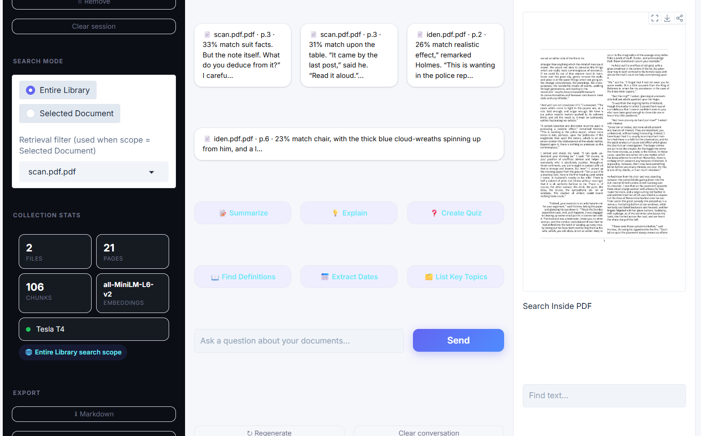

# Platypus

Platypus is a RAG (Retrieval-Augmented Generation) chat app that lets you upload PDFs and ask questions about them. It extracts text from your documents, chunks and embeds it, stores it in ChromaDB, and uses a local LLM (Zephyr-7B) to answer questions grounded strictly in the retrieved content — with page-level citations you can click to jump straight to that spot in the PDF.

It started as a single-notebook RAG pipeline and grew into a proper multi-document app with a three-panel UI: chat on one side, a live PDF preview on the other.

## Features

- Upload and index multiple PDFs into a shared vector collection
- Word-based chunking (200 words, 40-word overlap) that keeps page numbers attached to each chunk
- Retrieval scoped to a single document or the entire library, selectable from the sidebar
- Streaming answers (token-by-token) instead of a single blocking response
- Answers grounded only in retrieved context — the model is instructed to say "not found" rather than guess
- Source cards with a similarity score and a high/medium/low confidence badge
- Click a source card to jump to that page in the PDF preview, with the matching text highlighted
- Search inside a PDF (current document or whole library) with clickable results
- Conversation memory — follow-up questions like "explain it more simply" resolve against the last couple of turns
- Remove a single document or clear the whole session
- Export the conversation to Markdown or PDF, including sources and timestamps
- Dark/light theme toggle

## Tech Stack

- **UI:** Gradio (`gr.Blocks`), custom CSS for the three-panel layout and dark theme
- **PDF text extraction:** PyPDF2
- **PDF rendering / highlighting / search:** PyMuPDF (`fitz`) + Pillow
- **Embeddings:** `sentence-transformers`, model `all-MiniLM-L6-v2`
- **Vector store:** ChromaDB (single collection, cosine similarity space)
- **LLM:** `HuggingFaceH4/zephyr-7b-beta` via `transformers`, 4-bit quantized with `bitsandbytes` on GPU (falls back to float32 on CPU)
- **Streaming:** `TextIteratorStreamer` running generation on a background thread

## Project Structure

This is currently a single-file app (originally a Colab notebook, exported to `app.py`). Roughly, top to bottom:

- **Design tokens & CSS** — colors, fonts, and the full stylesheet passed into `gr.Blocks(css=...)`
- **Embedding model / LLM loading** — cached loaders for the SentenceTransformer and Zephyr model
- **App state & ChromaDB setup** — the in-memory document registry and the shared Chroma collection
- **PDF extraction & chunking** — `extract_pdf_pages`, `chunk_text`, `chunk_pdf_pages`
- **Indexing** — `index_pdf`, embeds and adds chunks to the collection with `doc_id`/`filename`/`page` metadata
- **Retrieval** — `retrieve_top_chunks`, `confidence_from_chunks`, `build_contextual_query`
- **Prompting & generation** — `build_prompt`, `stream_llm_response`, `answer_pipeline`
- **PDF preview rendering & search** — `render_pdf_page`, `search_in_pdf`
- **UI helpers** — HTML fragments for the document list, stats grid, confidence badges
- **Export** — `export_conversation_markdown`, `export_conversation_pdf`
- **Gradio callbacks & layout** — everything wiring the functions above to the actual UI components

## Installation

Clone the repository:

```bash
git clone https://github.com/rudrasinghlabs/Platypus-Chatbot
cd platypus
```

Install dependencies:

```bash
pip install PyPDF2 sentence-transformers chromadb transformers accelerate bitsandbytes gradio torch PyMuPDF Pillow
```

A CUDA GPU is strongly recommended. Zephyr-7B runs in 4-bit on GPU; on CPU it falls back to float32 and will be very slow.

## Usage

Run the app:

```bash
python app.py
```

Gradio will launch a local server (and a temporary public share link, since `demo.launch(share=True)` is set). Open the printed URL, upload a PDF from the sidebar, and start asking questions once it's indexed.

## How It Works

1. **PDF upload** — one or more PDFs are uploaded through the sidebar.
2. **Text extraction** — PyPDF2 pulls text out page by page, skipping empty pages and raising a clear error on corrupted or scanned/image-only PDFs.
3. **Chunking** — each page's text is split into overlapping windows of 200 words with a 40-word overlap, so context isn't lost at chunk boundaries. Every chunk keeps its page number.
4. **Embedding generation** — chunks are embedded with `all-MiniLM-L6-v2` (normalized, for cosine similarity).
5. **ChromaDB storage** — embeddings go into one shared collection, tagged with `doc_id`, `filename`, and `page`, so multiple documents can live together and still be attributed correctly.
6. **Retrieval** — a question is embedded and matched against the collection (top-4 by default), optionally filtered to a single `doc_id` if "Selected Document" scope is active. The last couple of conversation turns are folded into the query so follow-ups with pronouns still retrieve something sensible.
7. **LLM response generation** — the retrieved chunks are inserted into a prompt that instructs Zephyr to answer only from that context (and say so explicitly if the answer isn't there), streamed back token by token. Sources and confidence are computed from retrieval metadata, not from the model, so citations can't be hallucinated.

## Screenshots





## Future Improvements

- Move off Colab/notebook-style code into a proper `src/` layout with separate modules
- Persist the Chroma collection to disk instead of an in-memory client (currently everything resets on restart)
- Add OCR support for scanned/image-only PDFs
- Support other file types (docx, txt)
- Swap Zephyr for a smaller or API-based model as an option for people without a GPU
- Basic tests for chunking and retrieval logic

## What I Learned

Building Platypus helped me understand the complete RAG pipeline, from document chunking and vector search to prompt engineering and designing a user-friendly interface with Gradio.

## License

This project is licensed under the MIT License.

```
MIT License

Copyright (c) 2026 Rudra Pratap Singh Parihar

Permission is hereby granted, free of charge, to any person obtaining a copy
of this software and associated documentation files (the "Software"), to deal
in the Software without restriction, including without limitation the rights
to use, copy, modify, merge, publish, distribute, sublicense, and/or sell
copies of the Software, and to permit persons to whom the Software is
furnished to do so, subject to the following conditions:

The above copyright notice and this permission notice shall be included in all
copies or substantial portions of the Software.

THE SOFTWARE IS PROVIDED "AS IS", WITHOUT WARRANTY OF ANY KIND, EXPRESS OR
IMPLIED, INCLUDING BUT NOT LIMITED TO THE WARRANTIES OF MERCHANTABILITY,
FITNESS FOR A PARTICULAR PURPOSE AND NONINFRINGEMENT. IN NO EVENT SHALL THE
AUTHORS OR COPYRIGHT HOLDERS BE LIABLE FOR ANY CLAIM, DAMAGES OR OTHER
LIABILITY, WHETHER IN AN ACTION OF CONTRACT, TORT OR OTHERWISE, ARISING FROM,
OUT OF OR IN CONNECTION WITH THE SOFTWARE OR THE USE OR OTHER DEALINGS IN THE
SOFTWARE.
```
